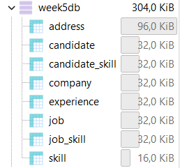
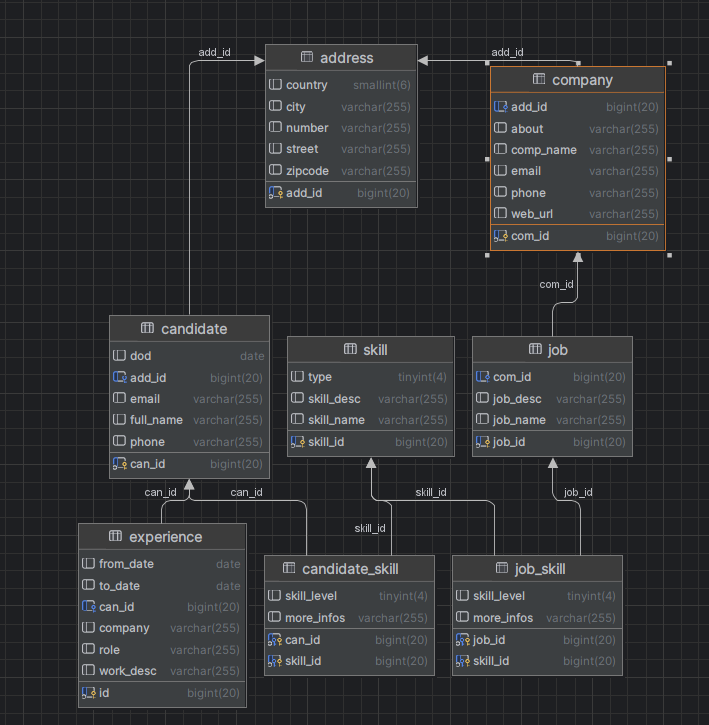
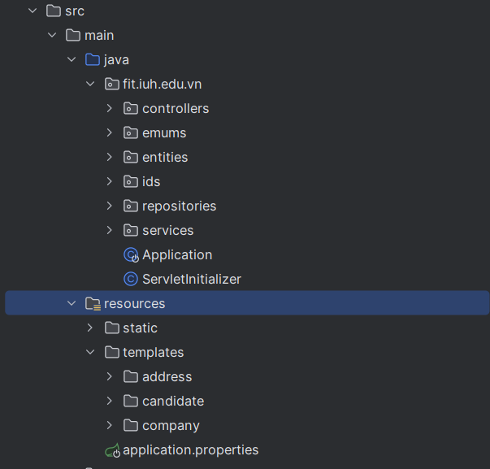
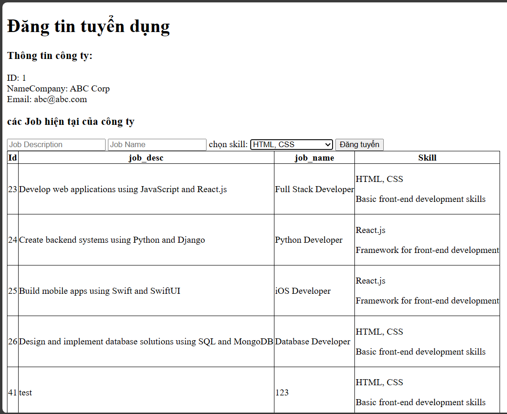
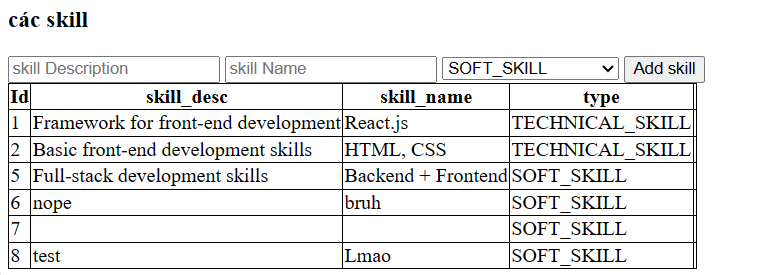
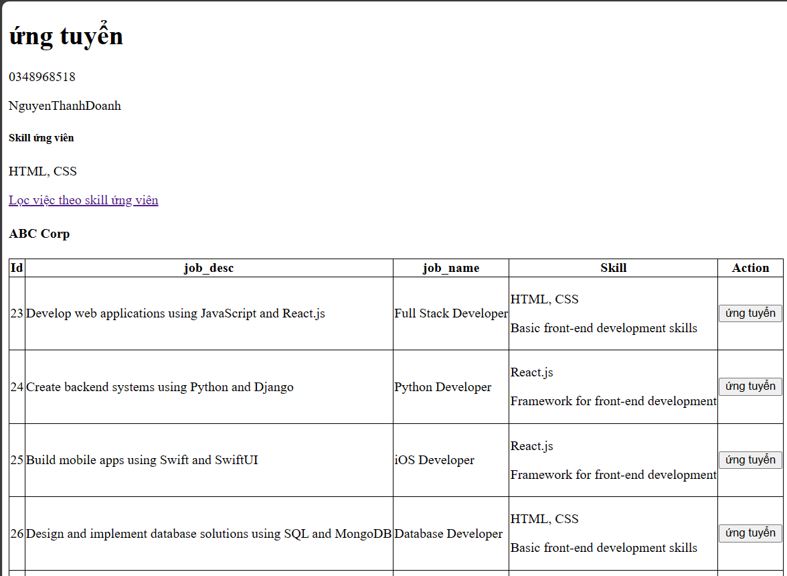
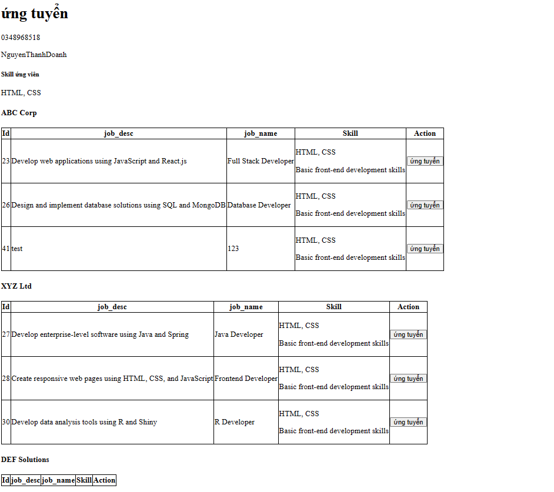
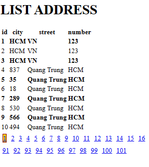

# 20054911_NguyenThanhDoanh_W5_WWW
Hoàn Thành: 
1.ORM sử dụng JPA
2.project source hoàn thành
4.Cho phép nhà tuyển dụng đăng tuyển Job
5.Đề xuất những job theo skill của ứng viên(được chỉ định sẵn)
6.Demo ứng dụng phân trang
## Database

diagram :
##  trúc source

## Đăng tin tuyển dụng của cty

## Thêm kỹ năng cty cần tuyển

## Màn hình ứng tuyển cho người lao động 

## Lọc theo skill

## Màn Hình Phân trang

